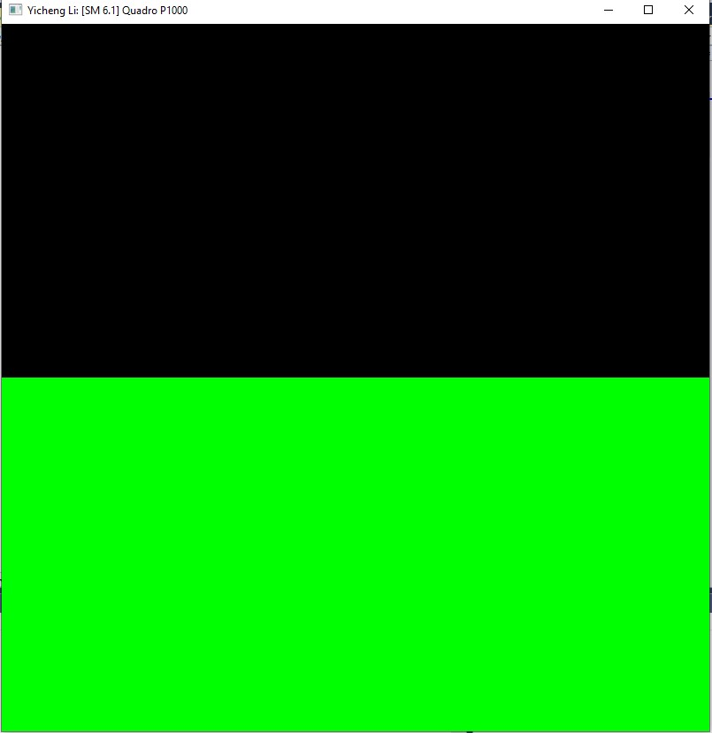
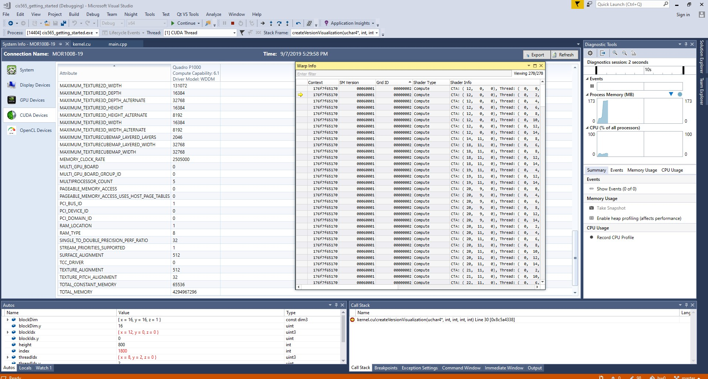

Project 0 Getting Started
====================

**University of Pennsylvania, CIS 565: GPU Programming and Architecture, Project 0**

* Yicheng Li
  * 
* Tested on: Windows 10, i7-6700 @ 3.40GHz 16.0GB, Quadro P1000 4096MB GDDR5 (Moore 100B Lab)

### Readme

The Moore workstations do not support DXR. 

Include screenshots, analysis, etc. (Remember, this is public, so don't put
anything here that you don't want to share with the world.)

